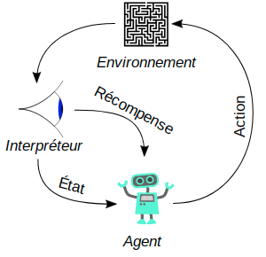
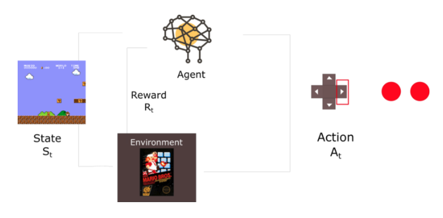
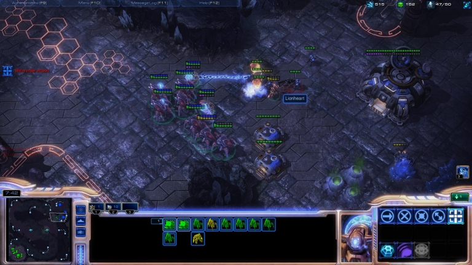
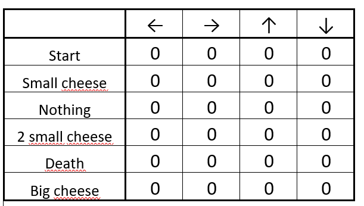
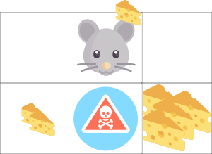
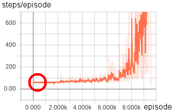
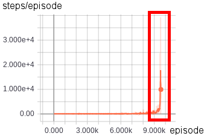

% ReinforcementLearning
% Sergiy Goloviatinski - inf3dlm-b - HE-Arc
% 31 Janvier 2019

## Sommaire
 
 

- But du projet
- Déroulement du projet
- Introduction au Reinforcement Learning
- Points importants du projet
- Conclusion
- Questions

## But du projet
 
 

- Prendre en main des solutions de deep RL
- Développer un module Python de RL avec des approches de deep Q-Learning

## Déroulement du projet
 
 

- Apprentissage RL + deep RL
- Comparaison frameworks deep RL
- Écriture d'un module python utilisant framework retenu pour explorer 2 scénarios:
  - Doom (interface: VizDoom[[1]](https://github.com/mwydmuch/ViZDoom))
  - FlappyBird (interface: PyGame Learning Environment[[2]](https://github.com/ntasfi/PyGame-Learning-Environment))

## Qu'est-ce que le Reinforcement Learning ?

<aside class="notes">
Le Reinforcement learning (apprentissage par renforcement en français), est une technique utilisée en intelligence artificielle consistant à faire apprendre à une IA quelles actions entreprendre selon l'état de l'environnement au moment d'entreprendre cette action, afin de maximiser un score.

Ne pas donner d'exemple avant image mario bros
</aside>

## Exploits du Reinforcement Learning

 
 

- AlphaGo[[3]](https://storage.googleapis.com/deepmind-media/alphago/AlphaGoNaturePaper.pdf) : 2016
- AlphaGo Zero[[4]](https://www.nature.com/articles/nature24270.epdf?author_access_token=VJXbVjaSHxFoctQQ4p2k4tRgN0jAjWel9jnR3ZoTv0PVW4gB86EEpGqTRDtpIz-2rmo8-KG06gqVobU5NSCFeHILHcVFUeMsbvwS-lxjqQGg98faovwjxeTUgZAUMnRQ): 2017
- AlphaStar[[5]](https://deepmind.com/blog/alphastar-mastering-real-time-strategy-game-starcraft-ii/) : 2019

<aside class="notes">
Dire juste qu'ils ont réussi de battre champion du monde/alphago/2 joueurs pro et que c'est surtout ca qui a fait parler du RL dernièrement
</aside>

## Q-Learning

- Q comme "qualité"
- <em>"Fonction qui prédit qualité d'une action exécutée dans un état donnée du système en se basant sur des expériences passées"</em>

<aside class="notes">
Au début, q table vide donc exploration
Dire que les valeurs de la Q-Table se mettront à jour à chaque nouvelle action, selon la récompense reçue
Donc au bout d'un moment quand on aura assez de Q-values, on pourra passer à l'exploitation
</aside>

## Deep Q-Learning
 
 

<aside class="notes">
on peut utiliser le réseau de neurones pour approximer une fonction qui donnerait une Q-Value pour un état donné, en essayant de généraliser pour tous les états possibles en sauvegardant les poids des neurones pour chaque état différent et en réutilisation pour améliorer généralisation
</aside>

## Comparaison de frameworks de RL

- keras-rl[[6]](https://github.com/keras-rl/keras-rl)  vs dopamine[[7]](https://github.com/google/dopamine)
- Critères de comparaison
  - Présence de divers algorithmes de deep Q-Learning
  - Facilité d'intégration
  - Maturité et fréquence de mise à jour sur github
  - Pour un scénario donné:
    - Temps d'apprentissage pour n épisodes
    - Score moyen sur 100 épisodes de test

## Framework retenu: keras-rl

- Plus facile à prendre en main que dopamine
- Meilleurs scores dans scénarios de test
- Plus mature
- Le reste des critères, ~ équivalent

<aside class="notes">
Tableau du bas: 2 algos dopamine + 2 algos keras-rl
Les slides d'après, j'ai utilisé keras-rl pour les scénarios
</aside>

## Doom - Présentation du scénario

Récompense:

- Par défaut:
  - +1 si tue ennemi
  - -1 si meurt
- <strong>+1 si touche ennemi</strong>
- <strong>-0.1 si perds vie/munition</strong>

Données accessibles:

- Input du réseau de neurones:
  - Pixels (78x52 ou 160x84)
- Calcul de la fonction de score:
  - Points de vie
  - Munitions
  - Nombre de touchers

## Doom - Résultats

  
Début entraînement  
  <video width="320" height="240" controls>
  <source src="./img/untrained_doom.ogv" type="video/ogg"></video>
  

  
NN Input: image 78x52<video width="320" height="240" controls>
  <source src="./img/midtrained_doom.ogv" type="video/ogg"></video>

  
NN Input: image 160x84<video width="320" height="240" controls>
  <source src="./img/trained_doom.ogv" type="video/ogg"></video>

## Flappy Bird - Présentation du scénario

Récompense:

- +1 par tuyau passé
- <strong>hauteur impact dernier tuyau</strong>
- -5 si tombe

Input réseau de neurones: 

- Vecteur caractéristique
  - <strong>player y position</strong>
  - players velocity
  - next pipe distance to player
  - <strong>next pipe top y position</strong>
  - <strong>next pipe bottom y position</strong>
  - next next pipe distance to player
  - next next pipe top y position
  - next next pipe bottom y position

## Flappy Bird - Résultats

  
Début entraînement  

  
Premiers progrès  

  
Fin entraînement  

## Conclusion
 
 

- Grande partie du projet était l'apprentissage des algorithmes de deep RL
- Difficultés du RL
  - Interface avec environnement
  - Conception de la fonction de récompense (important)
  - Accès aux données
- Résultats convaincants, surtout FlappyBird

## Questions ?